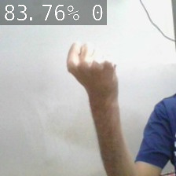

# Hand Signals Calculater

My project uses AI and datasets to do math calculations with hand signals.

This calculater uses datasets to analyse the hand signal infront of it. It then adds the chosen number to list so the user can have multiple digit numbers. The user will then input the the calculation they want to do. After they do this the code turns the list of numebrs into one single number and clears the list so the user can input their second number. The code then does the chosen operation to both of the numbers and prints the output.

## Running this project

1. Run the project by typing python3 ProjectCode.py
2. Use hand signals to input digit into your first number.
3. Click c and then enter.
4. Repeat steps 1 and 2 until you have finished inputing the number you want.
5. Select your operation of choice(plus, minus, times and divide).
6. Repeat steps 1,2 and 3 for your second number.
7. Click the equals key
8. Click enter.

[View a video explanation here](video link)
